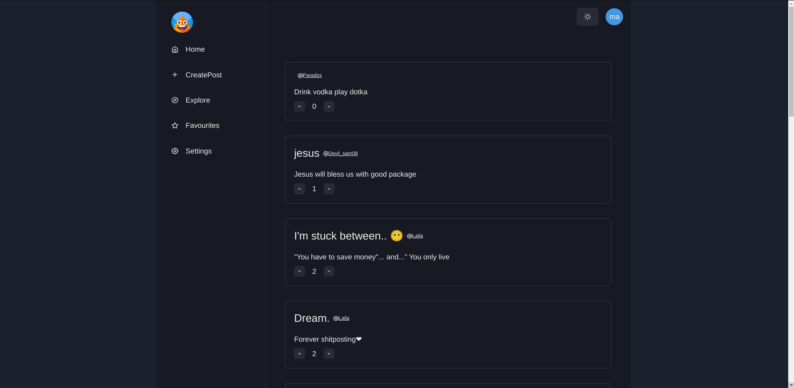

<div align="center">
  
  
  # Shit-Post.tech
</div>

<div align="left">
  <h3>
    <a href="https://web.shitPost.tech" target="_blank">Live Demo</a>
  </h3>
</div>

<!-- TABLE OF CONTENTS -->
## Table of Contents

- [Overview](#overview)
- [Built With](#built-with)
- [Features](#features)
- [Setup Guide](#setup-guide)
- [Show Your Support](#show-your-support)

## Overview

Shit-Post.tech is a web app that allows users to create, edit, like, and delete posts like Reddit. With a simple and intuitive interface, users can easily interact with content, engage with other users, and manage their posts. This project showcases the integration of modern web technologies on both the front end and backend.

## Built With

### Frontend
- **Next.js** - React Framework for Production
- **TypeScript** - Typed JavaScript at Any Scale
- **URQL** - GraphQL Client
- **Chakra UI** - Simple, Modular, and Accessible Component Library

### Backend
- **Node.js** - JavaScript Runtime
- **TypeScript** - Typed JavaScript at Any Scale
- **GraphQL (Apollo)** - Query Language for Your API
- **TypeORM** - ORM for TypeScript and JavaScript
- **Redis** - In-Memory Data Structure Store for Session Management
- **PostgreSQL** - Relational Database Management System
- **Docker** - Containerization Platform
- **Nginx** - Reverse Proxy Server

## Features

- **User Authentication**
  - Sign In
  - Register
  - Password Reset
- **User Interactions**
  - Create Posts
  - Edit Posts
  - Delete Posts
  - Upvote/Downvote Posts
- **Pagination** - Efficient Content Browsing
- **Session Management** - Stored in Redis for Performance Optimization

## Setup Guide

To get started with the project locally, follow these steps:

### Backend Setup

1. **Clone the repository:**

    ```bash
    git clone https://github.com/your-repo/shit-post-tech.git
    ```

2. **Navigate to the server directory:**

    ```bash
    cd server
    ```

3. **Update your environment variables:**

    Configure your database and Redis settings in the `.env` file.

4. **Install dependencies and start the backend:**

    ```bash
    yarn install
    yarn watch
    yarn dev
    ```

### Frontend Setup

1. **Navigate to the client directory:**

    ```bash
    cd client
    ```

2. **Install dependencies and start the frontend :**

    ```bash
    yarn install
    yarn dev
    ```

### You're All Set!

Your local setup is now complete. Explore the features and enjoy the experience!

## Show Your Support

If you found this project helpful, consider giving it a ⭐️ on GitHub.

<p align="center">
  <a href="https://twitter.com/Majjikishore1" target="_blank">
    
  </a>
</p>

---
